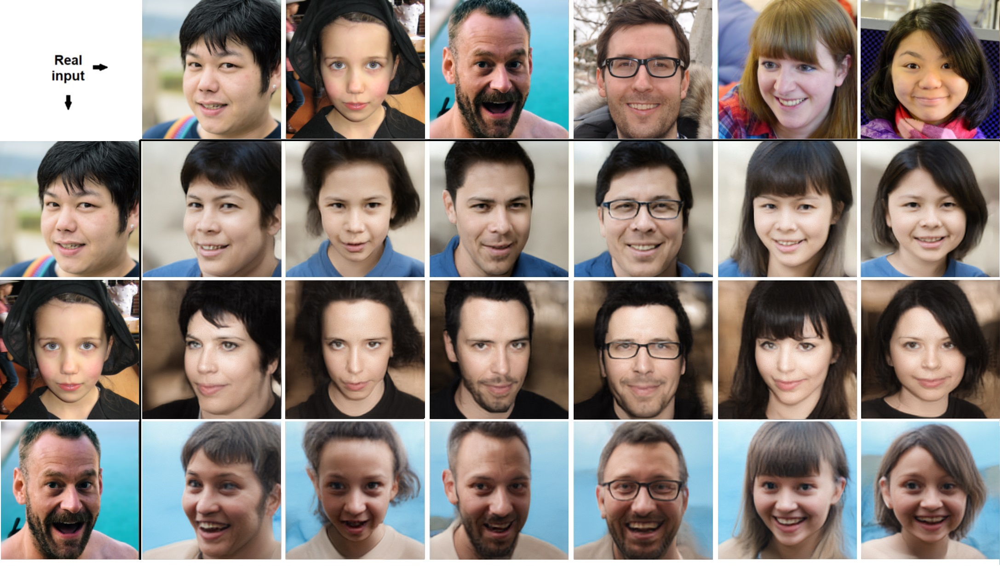

# Deep Automodulators

<i>TL;DR - Instantaneous semantic manipulation of existing images with scale-specific feature mixing.</i>

The grand goal of Deep Generative Models is to automatically learn semantic "knobs" for content design and smart editing. In image space, this means e.g. letting you simply adjust the "male-ness knob" of face, instead of operating those pixels. Similar knobs will eventually be available for designing 3D structures, proteins, artificial organs etc.

Here, we present the automodulator - an autoencoder with scale-specific control of outputs and the ability to mix several input images into a single fusion image. Though you can do the same with random images in e.g. StyleGAN, it is extremely slow if you try to work on existing images, with even a fast GPU requiring <b>several minutes for just a single image</b>. Automodulator allows the same instantaneously, as it is <b>an autoencoder, not a GAN</b>.

The quality? See below and judge for yourself. Roughly speaking, ~1/3 of typical face images appear to work as well as these ones.

Get started instantly with our <a href="https://colab.research.google.com/drive/1o1KQofPGdXSD-Zzxs32oHBuW_DeIPnnN">Colab notebook</a> and share your results!


<br/>
Fig. Apply coarse features of the top row 512x512 inputs on the left-most column inputs. Diagonals contain the 'traditional' reconstruction. For e.g. cars, see the Appendix of the <a href="https://arxiv.org/abs/1912.10321">paper</a>. For e.g. attribute editing, see the <a href="https://github.com/AaltoVision/automodulator/blob/master/Automodulator%20Evaluator.ipynb">Notebooks</a>.

## Abstract

We introduce a new family of generative neural network models called automodulators. These autoencoder-like networks can faithfully reproduce individual real-world input images like autoencoders, and also generate a fused sample from an arbitrary combination of several such images, allowing 'style-mixing' and other new applications. An automodulator decouples the data flow of decoder operations from statistical properties thereof and uses the latent vector to modulate the former by the latter, with a principled approach for mutual disentanglement of decoder layers. This is the first general-purpose model to successfully apply this principle on existing input images, whereas prior work has focused on random sampling in GANs. We introduce novel techniques for stable unsupervised training of the model on four high-resolution data sets. Besides style-mixing, we show state-of-the-art results in autoencoder comparison, and visual image quality nearly indistinguishable from state-of-the-art GANs. We expect the automodulator variants to become a useful building block for image applications and other data domains.

## Materials

[Paper](https://arxiv.org/abs/1912.10321)<br/>
[PyTorch Code](https://github.com/AaltoVision/automodulator)<br/>
[Pre-trained models](https://drive.google.com/drive/folders/1_Sgq9DV3XvNt0JYC3lTkSD9VICuRzP1-)<br/>
[Colab Notebook](https://colab.research.google.com/drive/1o1KQofPGdXSD-Zzxs32oHBuW_DeIPnnN)<br/>
[Jupyter Notebook](https://github.com/AaltoVision/automodulator/blob/master/Automodulator%20Evaluator.ipynb)<br/>

## Support

For all correspondence, please contact ari.heljakka@aalto.fi.

## Referencing

Please cite our work as follows:

```
@article{Heljakka+Solin+Kannala:2020,
      title = {Deep Automodulators},
     author = {Heljakka, Ari and Hou, Yuxin and Kannala, Juho and Solin, Arno},
    journal = {arXiv preprint arXiv:1912.10321},
       year = {2020}
}
```
